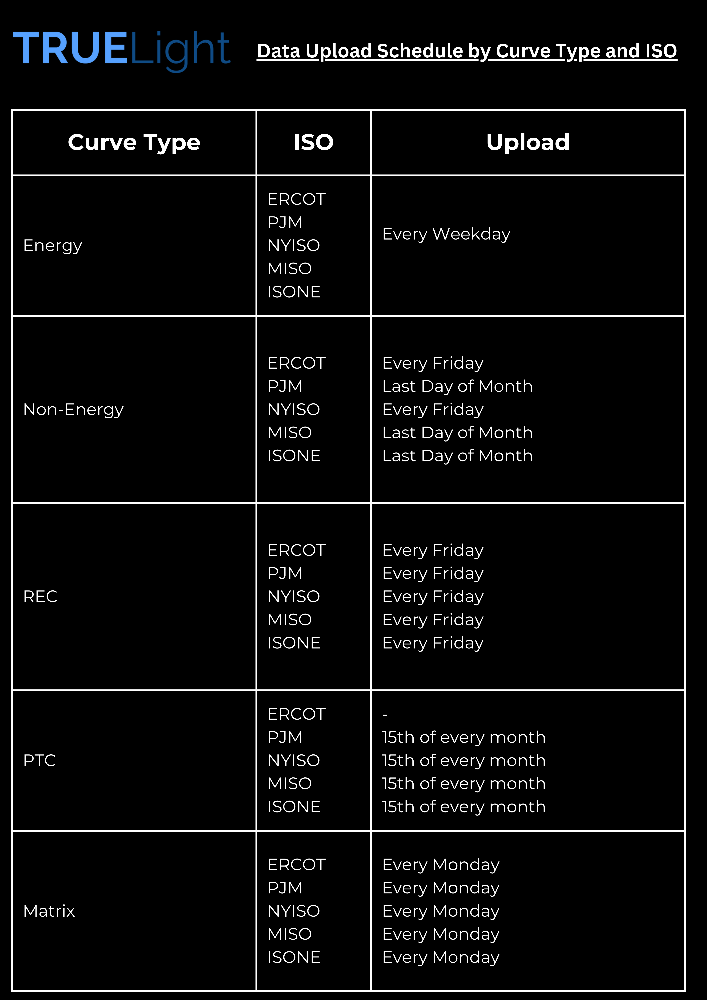

# Introduction

Welcome to the TRUEPrice™ API! This document describes how to interact with TRUEPrice™ API services to retrieve TLE product.

Contact **`techsupport@truelightenergy.com`** for more information.

- Visit [Our Website!](https://www.truelightenergy.com/contact)


### Prerequisites:
- Ensure you have **Python 3** installed.
- Install the requests library if it’s not already installed:
    **`pip install requests`**      
- You will need API credentials (email and password) to authenticate and obtain an access token for secure requests. 


# Authentication

> To authorize, use this code:

```python
import requests
def login(email = "email@forTRUEPrice™.com", password = "password"):
             url = "https://truepriceenergy.com/login"
             querystring = {"email":email,"password":password}
             response = requests.request("GET", url, params=querystring, verify=False)
             return response.text
          
#Example Usage
response = login("your_email@example.com", "your_password")

```


> Make sure to replace `email & password` with your own credentials.

- Ensure you have imported the necessary Python modules at the start of your script:
                      `import requests`
- The login function authenticates the user using their email and password, returning a login response that includes an access token. This token is necessary for subsequent API calls.
- Default Credentials: You may pass the default credentials "dummy@truelightenergy.com" or your own credentials.


`Output: The function returns the access token (or error response)`

<aside class="notice">
You must replace <code>email & password </code> with your own credentials.
</aside>

# Functions

## Download Data


`The Access Token recieved after login is used in this function to download data.`

```python
def get_data(access_token, start_date, end_date, operating_day,curve, iso, strip, history, type):
    
    url = "https://truepriceenergy.com/get_data"
    querystring = {
        "start": start_date,
        "end": end_date,
        "operating_day": operating_day,
        "curve_type": curve,
        "iso": iso,
        "strip": strip,
        "history": history,
        "type": type
    }
    headers = {"Authorization": f"Bearer {access_token}"}
    
    # Make the API request
    response = requests.request("GET", url, params=querystring, headers=headers, verify=False)
    
    # Save the response content as a CSV file
    file_name = f"{curve}_{iso}.csv"
    with open(file_name, "wb") as file:
        file.write(response.content)
    
    print(f"Data saved to {file_name}")
    return response


# Example:
access_token = eval(login("your_email@example.com", "your_password"))["access_token"]

#Response
data_response = get_data(your_access_token, your_start_date, your_end_date, your_operating_day, your_curve, your_iso, your_strip, your_idcob, your_type)

```


### HTTP Request

`GET https://truepriceenergy.com/get_data`

##### **Request Parameters**

| Parameter       | Type    | Required | Description                                                                 |
|-----------------|---------|----------|-----------------------------------------------------------------------------|
| `access_token`  | string  | Yes      | The access token for authentication.                                        |
| `start_date`    | string  | Yes      | The start date for the data retrieval in `YYYY-MM-DD` format.              |
| `end_date`      | string  | Yes      | The end date for the data retrieval in `YYYY-MM-DD` format.                |
| `operating_day` | string  | No       | The operating day for the data retrieval in `YYYY-MM-DD` format.           |
| `offset`        | string  | No       | Offset value for pagination or filtering.                                   |
| `curve`         | string  | Yes      | The type of curve (e.g., `energy`, `nonenergy`, `rec`).                    |
| `iso`           | string  | Yes      | The ISO region (e.g., `isone`, `pjm`, `ercot`, `nyiso`, `miso`).           |
| `strip`         | string  | No       | The strip type (e.g., `standardized`, `unstandardized`).                              |
| `history`       | boolean | No       | Whether to include historical data (`True` or `False`).                    |
| `type`          | string  | Yes      | The response format (e.g., `csv`,`xlsx`).   


| Header           | Value                          |
|------------------|--------------------------------|
| `Authorization`  | `Bearer <access_token>`        |


## Working with Multiple Data Types & Handling Specific Scenarios


```python

`ERCOT`
#Formatted Standardized Data
energy_ercocot_data = get_data(access_token, "2000-01-01", "9999-12-31", "", "", "energy", "ercot","standardized", False, "csv")

# Unformated Unstandardized Data
energy_ercocot_data = get_data(access_token, "2000-01-01", "9999-12-31", "", "", "energy", "ercot",'unstandardized', "intradayonly", "csv")

`ISO-NE`
#Formatted Standardized Data
energy_isone_data = get_data(access_token, "2000-01-01", "9999-12-31", "", "", "energy", "isone","standardized", False, "csv")

# Unformated Unstandardized Data
energy_isone_data = get_data(access_token, "2000-01-01", "9999-12-31", "", "", "energy", "isone",'unstandardized', "intradayonly", "csv")

`NYISO`
#Formatted Standardized Data
energy_nyiso_data = get_data(access_token, "2000-01-01", "9999-12-31", "", "", "energy", "nyiso","standardized", False, "csv")

# Unformated Unstandardized Data
energy_nyiso_data = get_data(access_token, "2000-01-01", "9999-12-31", "", "", "energy", "nyiso",'unstandardized', "intradayonly", "csv")

`MISO`
#Formatted Standardized Data
energy_miso_data = get_data(access_token, "2000-01-01", "9999-12-31", "", "", "energy", "miso","standardized", False, "csv")

# Unformated Unstandardized Data
energy_miso_data = get_data(access_token, "2000-01-01", "9999-12-31", "", "", "energy", "miso",'unstandardized', "intradayonly", "csv")

`PJM`
#Formatted Standardized Data
energy_pjm_data = get_data(access_token, "2000-01-01", "9999-12-31", "", "", "energy", "pjm","standardized", False, "csv")

# Unformated Unstandardized Data
energy_pjm_data = get_data(access_token, "2000-01-01", "9999-12-31", "", "", "energy", "pjm",'unstandardized', False, "csv")

```

This endpoint retrieves curves based on Data Types, ISO's.

Each data type can be formatted or unformatted, standardized or unstandardized and saved directly to a desired file format( csv,xlsx,json)




### HTTP Request

`GET https://truepriceenergy.com/get_data`

# Example Notebook

To understand how to use the API in detail, check out this Jupyter notebook:

<a href="https://colab.research.google.com/github/TLE-TRUEPrice/TruePrice/blob/main/notebooks/APIGuide.ipynb" target="_blank" style="display:block; margin: 10px 0 0; font-weight:bold;">
  ↗ Open in Google Colab – API User Guide Notebook
</a>

# Pricing Desk

For detailed guidance on using the Pricing Desk interface and understanding available features, refer to the user manual below:

<a href="https://tle-trueprice.github.io/PricingDeskUserGuides/" target="_blank" style="display:block; margin: 10px 0 20px; font-weight:bold;">
  ↗ Pricing Desk User Guide
</a>


